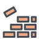
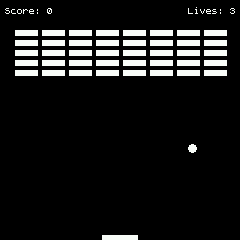

# BrickBreaker

A simple BreakOut clone for the Banglejs

## Usage

Use buttons 1 and 2 to move the BrickBreaker!
Button 3 is used to restart the game.

## Disclaimer

This game was created to learn JS and how to interact with Banglejs, meaning that it may not be perfect :).
Build with love with base on the tutorial: 2D breakout game using pure JavaScript
https://developer.mozilla.org/en-US/docs/Games/Tutorials/2D_Breakout_game_pure_JavaScript
And the inspiration and copy-pasting from the Bangle Pong game by Frederic Rousseau

## Creator

Israel Ochoa <isuraeru at gmail.com>